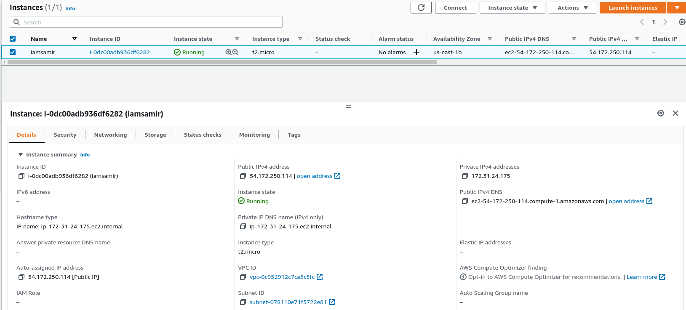
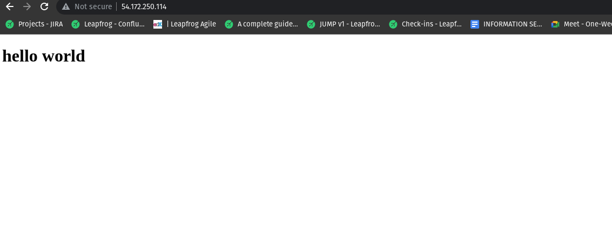

# Launch an EC2 instance and login via ssh furthermore, install httpd(apache).

## EC2 instance running:
 


## A web page served with apache2 running.  
 

### commands for ssh configuration
ssh -i /path/key-pair-name.pem instance-user-name@instance-public-dns-name

1. ``` ssh -i  key.pem ec2-user@public_ip ```

### commands to install apache in ec2 instance

1. Update (optional)

``` sudo yum update -y ``` 

2. Install apache web server

``` sudo yum install -y httpd ```

3. Start Apache web server

``` sudo systemctl start httpd ```

4. Create a index.html file inside ``` /var/www/html/ ```