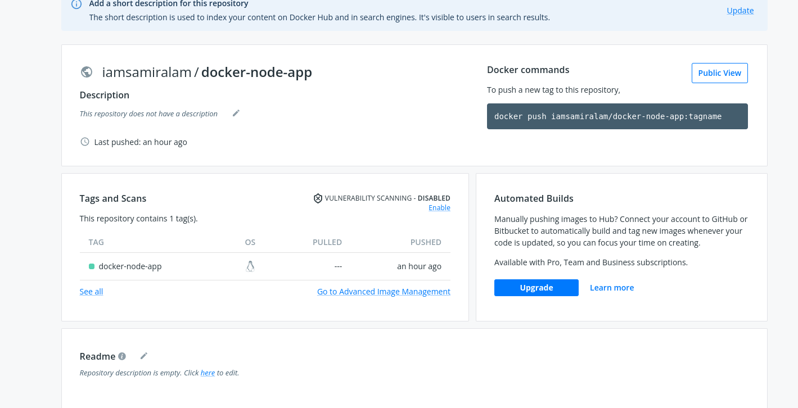
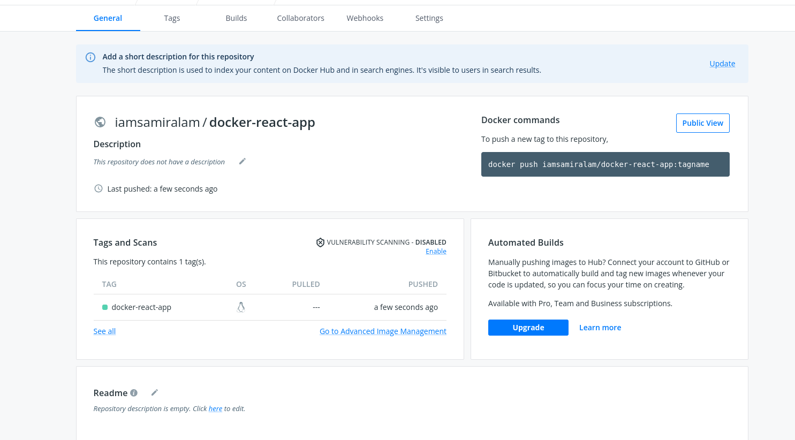

# Create a Dockerfile for node js and react and push the created docker images to the docker hub repository.

# Docker Images for Nodejs and React

## Nodejs image in Docker Hub

 
[nodejs image link](https://hub.docker.com/repository/docker/iamsamiralam/docker-node-app)

## React image in Docker Hub

[react image link](https://hub.docker.com/repository/docker/iamsamiralam/docker-react-app)
